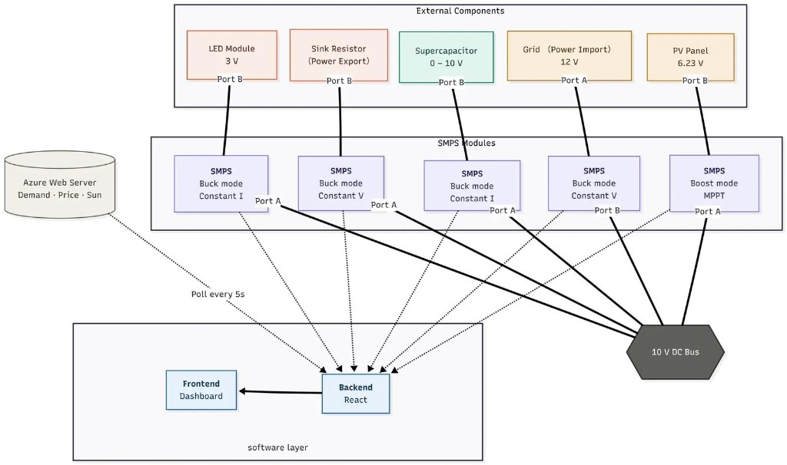
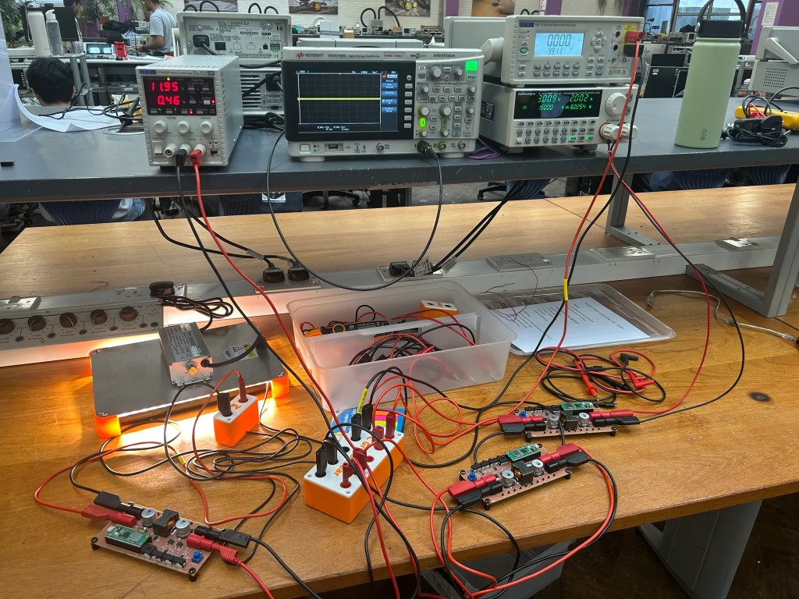
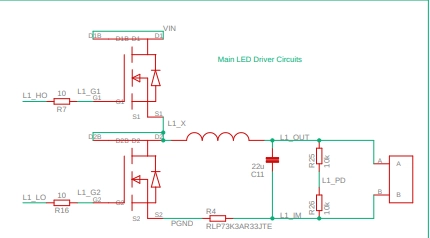
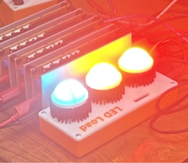
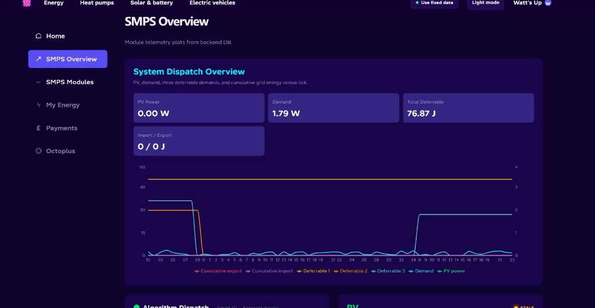

# Yong Zhi Tong — Engineering Portfolio

I am a Masters student in Electrical and Electronic Engineering at Imperial College London (First Class Honours, Dean’s List). I work across power electronics, embedded systems, and software — from switch-mode supplies and PCB design to Python backends and firmware. Experience includes undergraduate teaching in digital/analogue circuits, an electrical engineering internship at Technip Energies, and team projects spanning hardware, control, and full-stack development.

**Contact:** [yzt24@ic.ac.uk](mailto:yzt24@ic.ac.uk) · London, UK

---

## Projects

### Watt’s Up — Smart Grid System

**Second Year Electronics Design Project · May–Jun 2026**

This project invovled creating a DC microgrid with a PV panel, supercapacitor module, grid import/export moduels, modelled by bench power supplies and a resistor bank; and an LED load — built with a team of 7. My focus was on the circuit interconnections schematics, and LED SMPS current control.

**[Demo video](./Smart%20Grid%20Full%20Demo.mp4)** · **[Project brief](./smart_grid_project_brief.pdf)** · **[Full write-up](./Watts_Up_Smart_Grid_Project_Report.pdf)**

#### Full Circuit Setup

Circuit schematic and hardware connections across five SMPS modules on a shared 10 V bus.

  

  

#### LED SMPS Control

Implemented a current controller to regulate LED current to the desired value. Power is commanded via \(I_{reg} = P / V_{led}\).

  
  

#### Power Monitoring UI

Interactive dashboard for real-time power and cost. Smart dispatch optimises operating cost via import/export.

  

---

### ELECTRO Bootcamp — ESP32 RC Car

**Malaysia STEM Outreach Program · Jun 2026 – Present**

Wi-Fi–controlled ESP32 RC car for a high-school STEM bootcamp (~28 students). Custom PCB integrates motor drive and battery power management; students drive the car from a phone over an ESP32-hosted website.

**[Firmware](./ELECTRO%20Bootcamp/electro_bootcamp.ino)** · **[Technical document](./ELECTRO%20Bootcamp/ESP32_RC_Car_Technical_Document.pdf)**

#### Custom PCB

KiCad board (53 × 67 mm) with ESP32 DevKit, TB6612FNG H-bridge motor driver, and MP2322 buck converter — battery-powered, no USB tether.

#### Motor Driver

TB6612FNG drives left/right DC motors from ESP32 GPIO + PWM. Final design uses 2 motors for reliable current draw from AA cells.

#### Power Supply

MP2322 buck SMPS steps 6 V battery down to 5 V for the ESP32, with feedback and ripple sized for stable onboard power.

#### Driving Website

ESP32 SoftAP hosts an HTML/JS UI with directional controls. Hold-to-drive buttons send HTTP requests that set motor direction and speed.

#### Chassis

3D-printed PLA body and lid (Fusion 360) with motor slots, PCB/battery mounts, and a rear ball caster for tool-friendly kit assembly.

---

### Remote-Controlled Signal Detecting Rover

**First Year Electronics Design Project · May–Jun 2025**

Remote-controlled rover (team of six) with analogue front-ends for infrared, radio, ultrasound, and magnetic sensing — filters, comparators, and coil characterisation for radio sensitivity — integrated with sensor and software teammates into a working system.

---

### Revizon

**Amazon University Engagement Program · Jul–Oct 2025**

Full-stack mobile app (team of 3) for A-Level exam practice: Python FastAPI backend/API and FlutterFlow frontend with exam-style question flows.

---

## Skills

| Area           | Tools                                                                |
| -------------- | -------------------------------------------------------------------- |
| Programming    | Python, C++, SystemVerilog, MATLAB                                   |
| Software & EDA | LTSpice, KiCad, DIALux, LabVIEW, Quartus Prime, FastAPI, FlutterFlow |
| Languages      | English, Malay, Mandarin                                             |

